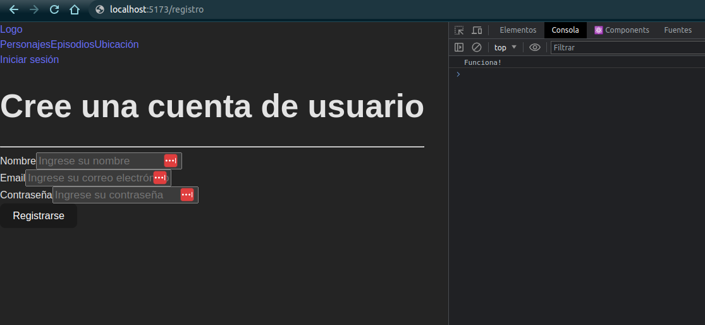
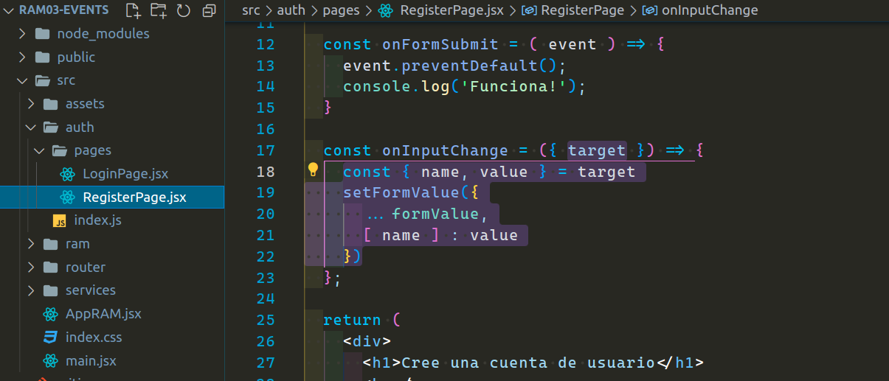

<p align='left'>
  
</P>

<a id="top"></a>

## `Bloques temáticos:`

- [**Maquetación de formulario**](#item1)
- [**Evento onSubmit**](#item2)
- [**Mantener estado de formulario**](#item3)
- [**Homework**](#item4)

---

---

Llegó el momento de los eventos. Si bien en clase se ve lo mismo, en este tutorial no vamos a ver `React Hook Form`. La razón es porque más adelante vamos a realizar un custom hook con este formulario para poder comparar con nuestro código y `React Hook Form`. Obviamente una librería siempre es más cómoda y rápida, pero nuestra idea también es que tengan otras variantes y formas de llegar a un mismo resultado, por otro lado, también nos ayudará a entender que sucede por detrás de esta gran librería `React Hook Form` que nos facilita tanto a la hora de escribir código para un formulario.

---

---

<a id="item1"></a>

## `Maquetación de formulario`.

---

Para comenzar voy abrir mi componente `RegisterPage.jsx` para armar la maquetación de mi formulario:

---


---

Mi componente de registro está compuesto por un `div` contenedor por el momento, debido a que estoy improvisando lo dejaré así por el momento, este contenedor tiene como hijo un título (`h1`) y la etiqueta `form`, estos los estoy separando con un `hr`.
Dentro del formulario creo otro `div` contenedor que tiene por un lado el `label` y por el otro un `input`. El input es de tipo text, además tiene el atributo placeholder para dar información al usuario de que trata el mismo y el atributo `name` que será de gran importancia más adelante. Además de este `div` contendor, debajo del mismo añadí un button de tipo submit que será el encargado de capturar justamente el submit del formulario. El button debe ser hijo de nuestra etiqueta `form`.

_Nota: Es importante utilizar la etiqueta `label` en los formularios HTML porque proporciona una serie de beneficios para la accesibilidad y usabilidad de los formularios. Por ejemplo, la vinculación con los campos de entrada mediante el atributo `for` y el atributo `id`. Además facilita la interacción, es decir, al hacer clic en la etiqueta, el cursor se coloca automáticamente en el campo de entrada asociado. Esto facilita la interacción y el uso del formulario, ya que los usuarios no necesitan hacer clic exactamente en el campo de entrada en sí._

Voy a agregar dos inputs más. Uno será para el email y otro para la contraseña.

El código con esta modificación es el siguiente:

---


---

Pueden notar que cada campo tiene un `div` contenedor. Esto me va a facilitar a la hora de añadir estilos.

_Los tipos (types) de los formularios en HTML son importantes porque definen el tipo de datos que se espera recibir en un campo de entrada (input) y ayudan a los navegadores a validar y procesar correctamente los datos enviados por el usuario._

algunos ejemplos de los tipos de campos que podrías utilizar en un formulario de registro son:

- text: Se utiliza para ingresar texto en una sola línea, como nombre y apellido.
- email: Permite ingresar direcciones de correo electrónico.
- password: Diseñado para ingresar contraseñas, ocultando los caracteres ingresados.
- date: Permite seleccionar una fecha de nacimiento o cualquier otra fecha relevante para el registro.
- number: Permite ingresar números, por ejemplo, para ingresar la edad.
- tel: Utilizado para ingresar números de teléfono de contacto.
- checkbox: Permite al usuario seleccionar una o varias opciones, como sus preferencias o suscripciones.
- radio: Permite seleccionar una opción de un conjunto de opciones mutuamente excluyentes, como el género.
- file: Permite al usuario cargar una foto de perfil o cualquier otro archivo relevante.
- submit: Crea un botón para enviar el formulario.

La elección de los tipos adecuados dependerá de los datos específicos que necesites recopilar y del diseño y funcionalidad de tu formulario.

Hay una gran variedad de tipos de inputs. En caso de querer profundizar los tipos de inputs recomiendo investigar en MDN:

<https://developer.mozilla.org/es/docs/Learn/Forms/HTML5_input_types>

Dicho esto, ahora veamos el resultado en el navegador. Debemos recordar que no tenemos ningún `Link` (enlace) que nos dirija a esta ruta, por ende, lo haremos manualmente por el momento.
En el navegador ingresamos la url de nuestro componente registro que en nuestro caso es el siguiente:

```
http://localhost:5173/registro
```

resultado en el navegador:


Bueno, ya con esto tendríamos nuestro maquetado terminado. Como podemos notar, vemos que se repite algo de código, por ende, ya podríamos estar pensando en una componetización, pero eso se los dejaré de tarea.

---

---

<a id="item2"></a>

## `Evento onSubmit`.

Mi `button` de type submit es el encargado de ejecutar el evento `onSubmit` de mi formulario. En la apertura de mi etiqueta `form` voy a añadir este evento pasando la función que también voy a estar creando a continuación.

Esta función la voy a declarar con el nombre de `"onFormSubmit"`. Como se vio en clases, la naturaleza del evento onSubmit es recargar la página, pero podemos eludir este comportamiento con el `preventDefault` y así poder respetar el comportamiento de una aplicación SPA (Single Page Application), sin necesidad de recargar toda la página.

En `React`, el primer parámetro que se pasa a la función `onSubmit` en un evento es el objeto de evento _(event object)_. El objeto de evento contiene información sobre el evento que ha ocurrido, como por ejemplo, la interacción del usuario, los datos del formulario y otros detalles relevantes.

El objeto de evento en `React` sigue la misma estructura que el objeto de evento en `JavaScript` puro. Algunas de las propiedades más comunes del objeto de evento en `React` incluyen:

- `event.target`: Es una referencia al elemento del _DOM_ en el que se originó el evento. Puede ser útil para acceder a los valores de los campos de un formulario, por ejemplo.

- `event.stopPropagation()`: Es un método que se puede llamar en el objeto de evento para detener la propagación del evento a través del árbol de componentes. Evita que otros componentes más arriba en la jerarquía reciban el evento.

- `event.preventDefault()`: Este es el método que nos interesa. Es un método que se puede llamar en el objeto de evento para prevenir el comportamiento predeterminado del evento, como enviar un formulario o seguir un enlace.

Ahora con esta información puedo añadir a mi función este método de `event.preventDefault()`.

Debajo del `preventDefault` voy a agregar un `console.log()` para asegurarme que la función implementada esté funcionando correctamente.

---


---

resultado en la consola:

---



---

Todo está funcionando correctamente hasta ahora.

[**subir**](#top)

---

<a id="item3"></a>

## `Mantener estado de formulario`.

Para generar mi estado de formulario usaré el hook `useState()`. Lo voy a importar desde react y declarar en la parte superior de mi función. Como ya sabemos, los hooks `useState()` siempre deben de estar en la parte superior de nuestro componente. Como estado inicial le pasaré un objeto con las siguiente propiedades:

---


---

Si ahora ustedes van a las devtools de su navegador podrán notar que ahora tenemos el hook con nuestro estado:

---


---

Sino tienen esta extensión en el navegador y les interesa, la podrán encontrar como `"React Developer Tools"`.

Ahora voy a establecer estos valores en mi formulario. Para hacer eso primero voy a desestructurar los mismos desde mi `formValue` y se los voy a pasar a cada input con la propiedad `value`. También podría hacer `formValue.username`, por ejemplo, pero a estas alturas ya deberíamos irnos acostumbrando a las desestructuraciones.


Si vamos a nuestro navegador ya tendríamos que ver los valores en nuestros inputs.


Como pueden comprobar los valores ya están en los inputs, pero también podrán notar que los mismos no se pueden cambiar ya que `React` trabaja en una sola vía.
Si se fijan, en la consola está arrojando un `"Warning"`, el mismo nos da una cierta pista. Nos dice que hemos proporcionado un valor a un campo de formulario sin un manejador `"onChange"`. Esto generará un campo de sólo lectura. Nos dice que debemos establecer el `onChange` o bien el `readOnly`. En nuestro caso, queremos poder modificar este campo, así que procederemos con el onChange.

[**subir**](#top)

---

---

<a id="item3"></a>

## `Evento onChange`.

Voy a crear una función que me permita hacer los cambios de mis inputs, esta función la voy a mandar como referencia en la propiedad `onChange` de cada uno de mis inputs.
El primer argumento que me va a pasar va a ser el evento, por ende, se lo voy a pasar a mi función y voy a hacer un `console.log(event)` para ver qué información obtengo.


Si vuelvo al navegador y presiono en uno de los inputs una tecla y miro en la consola va a mostrar un montón de información. Si nosotros buscamos entre toda esa información vamos a encontrar el `target` con el valor de nuestro input en el cual intentamos escribir.


Nosotros en nuestros inputs agregamos la propiedad `name`, ¿Recuerdan que les dije que iba a ser importante?. Bueno, ahora si nosotros en nuestra función hacemos un console.log(event.target.name), podemos ver que nos da la referencia al `name` del input que estamos escribiendo. Entonces con esto ya sabríamos las palabras claves para poder trabajar.


Voy a hacer dos desestructuraciones, una será en el parámetro para extraer el target del evento, y la otra será dentro de mi función donde voy a desestructurar el target para extraer el name y el value. Para hacer cambio del estado voy a mandar a llamar el `setFormValue` de mi `useState()` y voy a pasarle el objeto, ya que ese es el estado inicial de nuestro useState(). Con el operador spread voy a mantener el estado de todo lo que me llega ya que podrían ser muchas properties, y la que quiero cambiar va a ser la propiedad name. Para esto existe en JavaScript las propiedades computadas de los objetos, entre corchetes, le voy a decir que la propiedad `[ name ]` es la que voy a establecer en el objeto con el nuevo valor.



resultado:


Eso es todo, como pueden ver en la imagen anterior, ya podemos escribir en los campos.

[**subir**](#top)

---

---

<a id="item4"></a>

## `Homework`.

Dentro del directorio `auth` van a crear un nuevo directorio llamado `components`, en este lo que harán será crear un nuevo componente llamado `InputFormComponent.jsx`.

1 - Para implementar el componente `InputFormComponent` se debe armar la maquetación igual que cualquier input de nuestro registro con la salvedad que va a recibir las props necesarias para que funcione (type, label, name, value, placeholder, onInputChage).

2 - Exportar el nuevo componente en nuestro archivo de barril.

3 - Cambiar los inputs por nuestro nuevo componente y pasarle las props que está esperando el mismo.

Si quieren como práctica pueden armar también el login. Yo no voy a implementar la solución del login porque prácticamente es lo mismo visto hasta ahora.
