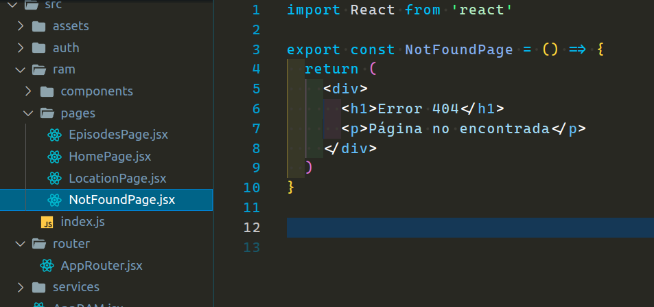
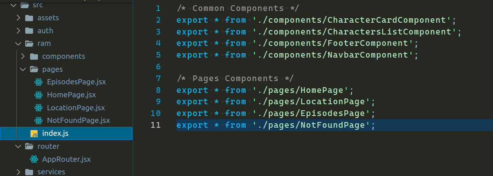
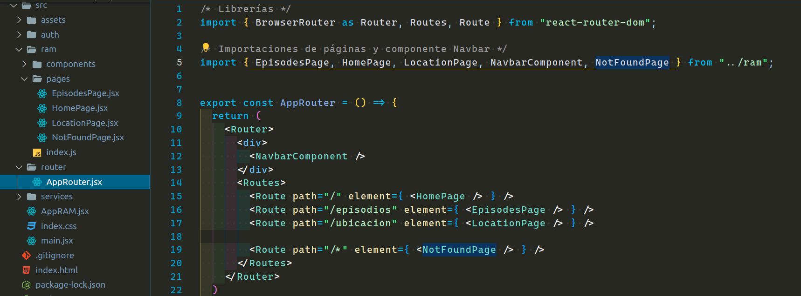
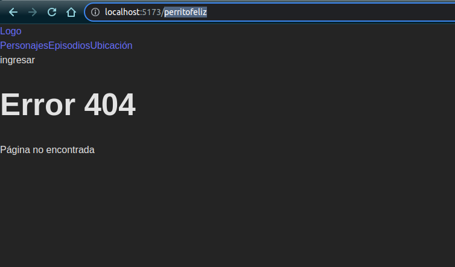
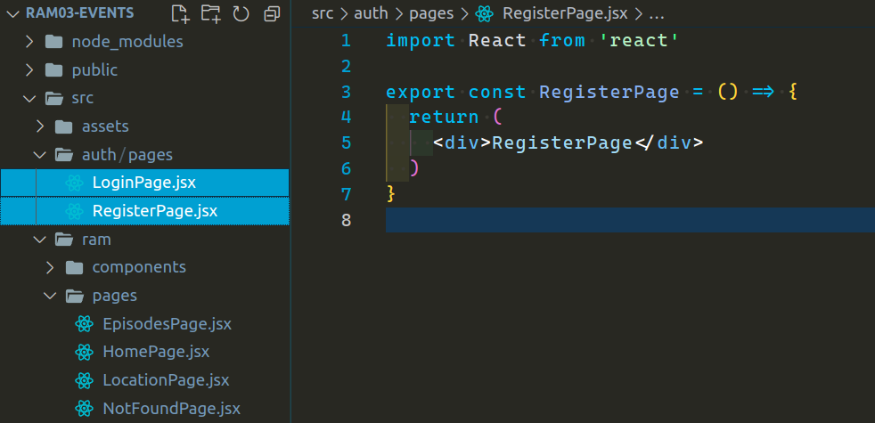
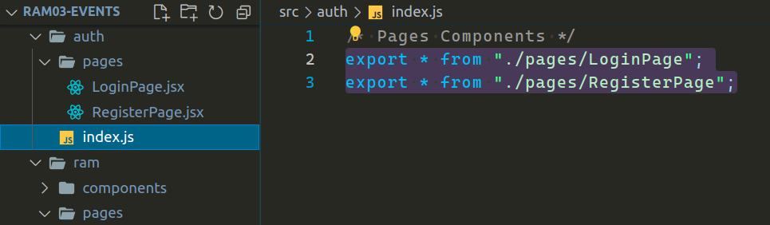
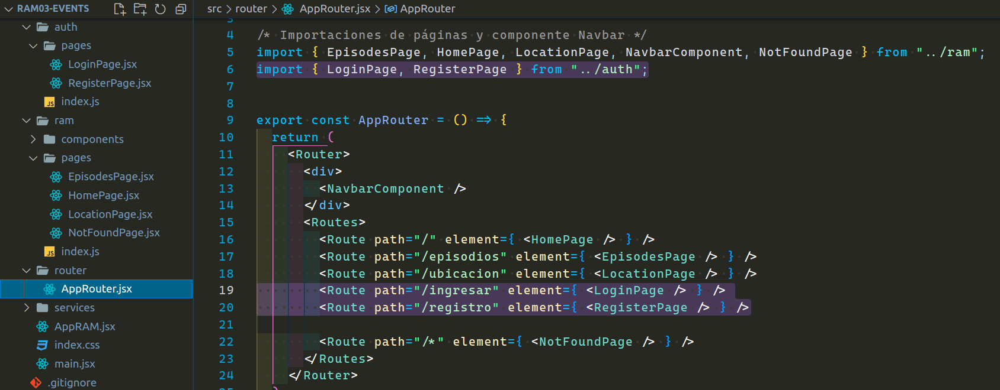
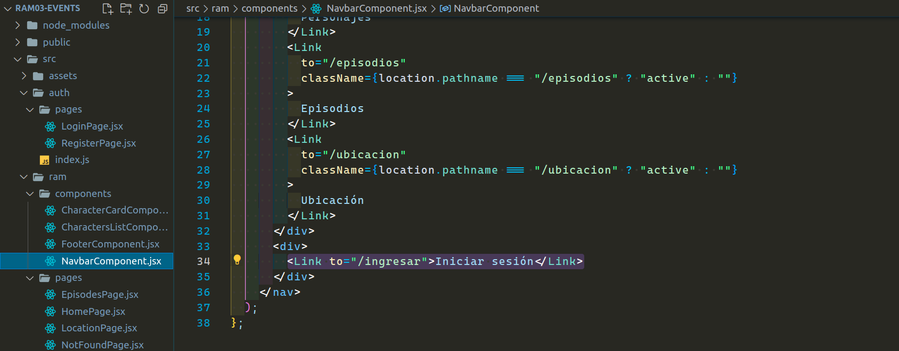

  

---

---

# `Solución homework`

---

En primer lugar nos pedía realizar un componente `NotFoundPage.jsx` dentro de nuestro directorio "pages" para los casos que nuestro enrutador no haga match con nuestras rutas.

Crearé este componente con la siguiente estructura:

---

---

También nos podía exportar este componente en nuestro archivo de barril.

---

---

Luego nos pedía crear nuestra ruta, de la cual su `path` iba a ser "/\*", el comodín indicaría que todo lo que venga después de nuestra barra o slash y no haga match con ninguna de nuestra rutas, nos llevaría a nuestro componente `NotFoundPage.jsx` recién creado.

---

---

resultado hasta el momento:

---

---

El siguiente paso era crear un directorio `pages` dentro de nuestro directorio `auth`, que este mismo contendría nuestras dos páginas, una de login y otra de registro. Por el momento los componentes de página no requerían de maquetación `jsx`.

---

---

El quinto paso era crear dentro de nuestro directorio `auth` nuestro archivo de barril y exportar tanto el componente `LoginPage` como el componente `RegisterPage`.

---

---

En el sexto paso debíamos crear las rutas en nuestro `AppRouter.jsx` de los componentes de página `"LoginPage"` y `"RegisterPage"`, el path era a elección, yo pondré ingresar para el "login" y registro para el "register".

---

---

Y por último nos pedía en nuestro componente `NavbarComponent.jsx`, que al dar clic en ingresar, nos dirigiera a la ruta que contenía nuestro componente `LoginPage`. Para esto debíamos usar el componente `Link` que nos ofrece la librería de `react-router-dom`.

Bueno, cambie el texto ingresar por `Iniciar sesión`. Con esto ya hemos terminado nuestra tarea. Espero lo hayan podido lograr o al menos intentado de hacer.

---

---

Los invito a intentar completar el siguiente TUTORIAL en el archivo `"TUTORIAL.md"`.

[**subir**](#top)
